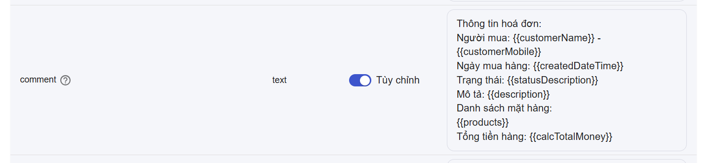
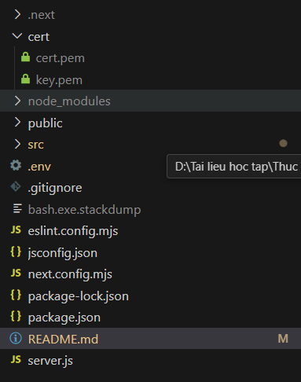

# Nhanh.vn orders mapping tới CareSoft deals

## Tổng Quan

Một ứng dụng trung gian giúp tích hợp liền mạch giữa các đơn hàng từ Nhanh.vn với các deal trong CareSoft CRM. Ứng dụng này đóng vai trò cầu nối giữa nền tảng thương mại điện tử Nhanh.vn và hệ thống quản lý khách hàng CareSoft, tự động chuyển đổi đơn hàng thành deal và đồng bộ dữ liệu theo thời gian thực.

## Tính Năng Chính

- **Cấu hình mapping**: Mapping linh hoạt giữa các trường dữ liệu Nhanh.vn và CareSoft.
- **Tự động tạo Deal**: Tự động tạo Deal khi nhận webhook từ đơn hàng Nhanh.vn vào CareSoft.
- **Cập nhật thời gian thực**: Cập nhật thời gian thực các deals theo trạng thái đơn hàng thay đổi từ Nhanh.vn.
- **Quản lý khách hàng**: Tự động tạo/cập nhật thông tin khách hàng dựa theo số điện thoại.
- **Giao diện cấu hình dễ sử dụng**: Nhập thông tin API và cấu hình ánh xạ dễ dàng.

## Yêu Cầu Trước Khi Cài Đặt

- Node.js (v18.20.8)
- npm (v10.8.2)
- Thông tin API của Nhanh.vn (AppID, Version, BusinessID, AccessToken, Webhooks verify token – phải khớp với app của bạn)
- Thông tin API của CareSoft (Domain, API Token)

## Cài Đặt

1. Clone the repository:

   ```bash
   git clone https://github.com/NguyenThanhLong264/nhanh-mapping.git
   ```
   - Hoặc có thể tải file .zip rồi giải nén (lựa chọn ở phần Code)

2. Di chuyển vào thư mục dự án:

   ```bash
   cd nhanh-mapping
   ```
   Hoặc nếu tải .zip
   ```bash
   cd nhanh-mapping-nhanh-mapping
   ```

3. Cài đặt thư viện:

   ```bash
   npm install
   ```

## Running the Application

### Development Mode

```bash
npm run dev
```

### Production Mode

```bash
npm run build
npm start
```

The application will be available at: [http://localhost:3000](http://localhost:3000)

## Hướng Dẫn Sử Dụng

1. **Initial Setup**

   - Thực hiện các bước cài đặt như ở phần trên
   - Khởi chạy ứng dụng bằng chế độ development hoặc production
   - Truy cập giao diện tại `http://localhost:3000`
   - **Đảm bảo ứng dụng có thể truy cập qua HTTPS** (ví dụ: ngrok, localtunel, hoặc cài chứng chỉ với mkcert, hoặc cách khác)

2. **Cấu Hình API**

   - Nhập thông tin API:
      
   - Nhấn Lưu

3. **Cấu Hình Các Trường**

   - Vào trang cấu hình (To Mapping)
   - Thực hiện ánh xạ các trường quan trọng giữa Nhanh.vn và CareSoft:
      + Bạn có thể chọn mapping với tham số từ webhook Nhanh.vn hoặc tùy chỉnh. 
      + Khi tùy chỉnh, bạn vẫn có thể dùng tham số dạng {{tên}} như {{customerName}}, {{product}},…
      + Ví dụ: "Đơn hàng của {{customerName}}" hoặc {{product}} sẽ tự động hiển thị danh sách sản phẩm
      
   - Một số trường đặc biệt::
      + pipeline_stage_id: Với mỗi pipeline stage trong CareSoft, bạn có thể ánh xạ tương ứng với một trạng thái đơn hàng bên Nhanh. Nếu không khớp, sẽ dùng pipeline mặc định.
      
      + order_status: Trạng thái đơn hàng của CareSoft có thể ánh xạ tương ứng với trạng thái Nhanh.vn.
      
      + order_products: 
         - CareSoft có mảng order_products và bạn có thể ánh xạ từ dữ liệu sản phẩm trong Nhanh.vn. 
         - Điều kiện: sản phẩm bên CareSoft và Nhanh phải cùng có SKU = id
         - Nếu không có sản phẩm sẵn trong CareSoft, hãy chuyển công tắc “Sản phẩm chưa nhập trên CareSoft”
      
      + custom_fields: CareSoft có các trường động, bạn phải nhập đúng ID và giá trị của từng trường. VD:
      
      + comment: trường này sẽ được dùng khi tạo deals mới, có thể dùng để nhắn 1 hóa đơn lên. VD:
      
      + Các trường comment.body, comment.is_public, comment.author_id: dùng khi cập nhật deal.

   - Sau khi cấu hình xong, nhấn "Lưu"

   ### Cơ Sở Dữ Liệu
   Ứng dụng sử dụng SQLite để lưu trữ thông tin ánh xạ giữa đơn hàng Nhanh.vn và Deal của CareSoft. Cơ sở dữ liệu được tạo và quản lý tự động. Tính năng này hỗ trợ cập nhật Deal nếu đơn hàng đã tồn tại.
   
4. **Cấu Hình Webhook**

   - Truy cập tài khoản Nhanh.vn tại [https://open.nhanh.vn](https://open.nhanh.vn)
   - Vào phần Cài đặt > Webhook
   - Thêm webhook với endpoint: `https://your-domain/api/webhookNhanhVN`
   - Thay `your-domain` bằng domain thực tế của bạn
   - Đảm bảo endpoint của bạn đang bật HTTPS

5. **Kiểm Tra Tích Hợp**

   - Tạo đơn hàng thử nghiệm trong Nhanh.vn
   - Kiểm tra trong CareSoft xem đã tạo Deal hay chưa
   - Kiểm tra các trường đã ánh xạ có đúng không
   - Thử cập nhật trạng thái đơn hàng để kiểm tra đồng bộ

6. **Cấu hình Https**
   - trong thư mục gốc của dự án, tạo thêm 1 folder tên cert chứa 2 file cert.pem và key.pem
   
   - copy lấy từ trong file Nginx có 2 file .key và .pem, nối như sau:
      - .key vào cert/key.pem
      - .pem vào cert/cert.pem
   - rồi chạy lại 
   ```bash
   npm i
   npm run build
   npm start
   ```